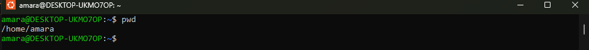
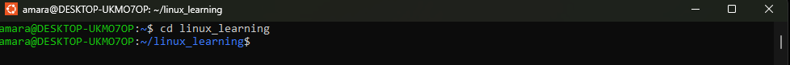
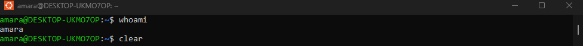
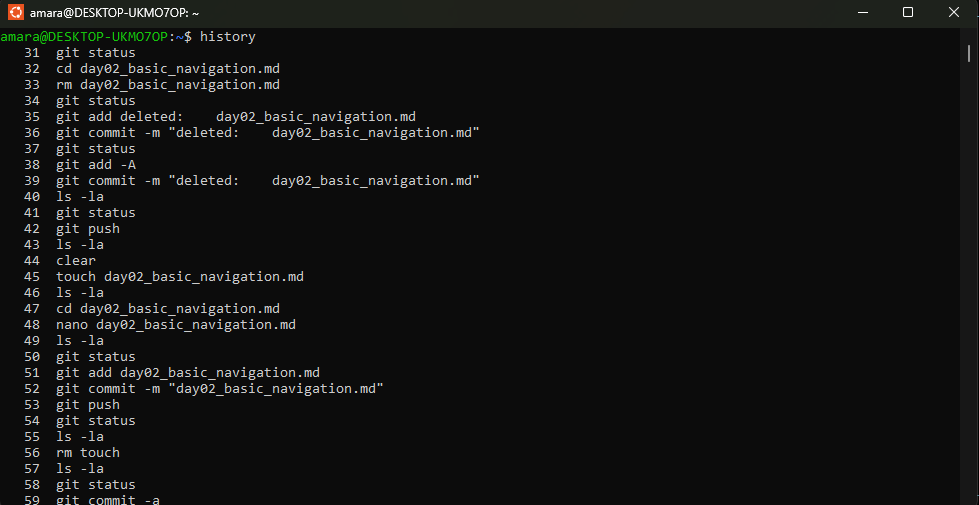

# Day 2 of My Linux Learning Journey
 

---

##   Topic: Basic Linux Navigation Commands

Today, I focused on mastering **fundamental navigation commands** in Linux.  
These commands form the foundation for working confidently within the terminal.  
They allow you to explore directories, view files, check documentation, and review past commands efficiently.  

---

## 1. `pwd` — *Print Working Directory*
The `pwd` command displays the **full path of the directory** you are currently working in.  
This is useful to avoid confusion, especially when moving between multiple directories.  

```bash
pwd
- Example Output:
/home/amarachi 


---

## 2. `ls` — *List Directory Contents*
The ls command shows the files and directories in your current location.
It can be combined with different options for more detailed views:

```bash
ls        # Basic list of files 
ls -l     # Long format (permissions, size, ownership, timestamp)  
ls -a     # Show hidden files (those beginning with . )  

---

## 3. `cd` — *Change Directory*
The cd command allows navigation between directories.

```bash
cd /etc     # Move into the /etc directory  
cd ..       # Go up one directory level  
cd ~        # Move to the home directory  
cd -        # takes you back to your previous directory.  

---

## 4.  `man` — Manual Pages
The man command displays the manual/help pages for other commands.
It’s a powerful tool for self-learning directly in the terminal.

```bash
man ls  

Press q to exit the manual viewer.
Example: man ls will show detailed documentation about the ls command.

---

## 5.  `clear` — *Clear the Terminal Screen*
The clear command removes clutter from your terminal screen, making it easier to focus.

```bash
clear 

---

## 6. `history` — *Command History*
The history command shows a list of previously executed commands.
This helps in recalling or reusing commands without retyping them.

```bash
history              # Show entire command history 
history | tail -n 5  # Show only the last 5 commands 


##📝 Key Takeaways

- Navigation commands (pwd, ls, cd) are your map and compass in Linux.

- man is your built-in documentation tool — use it often to deepen understanding at any time.

- clear helps with productivity, while history improves efficiency.

*These simple commands may seem basic, but they are the foundation for mastery in Linux system administration, cloud security, cloud computing, and DevOps*.


👩🏽‍💻 *Documented by:* **Amarachi Ezeonyekwere**  


