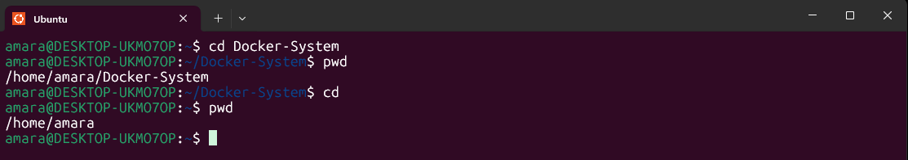
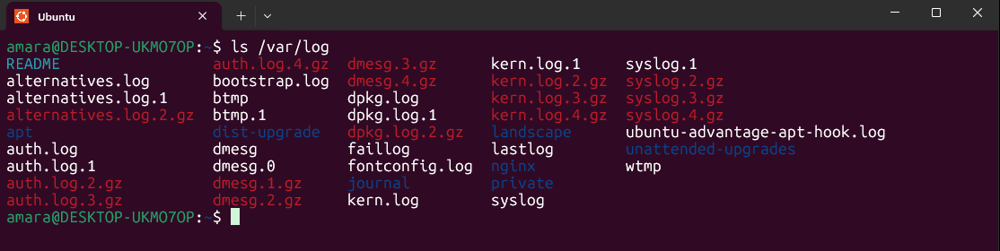

#   Day 3 of My Linux Learning Journey  
 

---

##  Topic: Linux Filesystem Structure  

The Linux filesystem is the **backbone** of the operating system. Every file, directory, configuration, log, and application lives within a well-defined structure.  

As a **Cloud Engineer / DevOps Engineer**, mastering this structure is essential for:  
- Confidently navigating the OS  
- Troubleshooting real-world issues  
- Locating configuration files and logs quickly  
- Understanding how applications interact with the OS  

---

##  Key Directories and Their Purposes  

| Directory | Purpose | Example Use Case |
|-----------|---------|------------------|
| `/` | Root of the entire filesystem hierarchy | Every directory and file stems from here |
| `/bin` | **Essential binaries** needed for user commands | Contains commands like `ls`, `cp`, `mv`, `rm` |
| `/etc` | **System-wide configuration files** | Configs for services (e.g., `/etc/ssh/sshd_config`) |
| `/home` | Personal directories for each user | Stores user files: `/home/username/` |
| `/var` | **Variable data** such as logs, mail, spools | Webserver logs in `/var/log/nginx/` |
| `/usr` | Secondary hierarchy for applications and read-only data | Software like `/usr/bin/python3` |
| `/tmp` | Temporary files, often cleared at reboot | Apps store temp files here |
| `/dev` | Represents hardware devices as files | Disk as `/dev/sda`, USB as `/dev/sdb` |

---

##   Real-World Case Study  

###  Scenario  
While managing a production web server, users reported downtime.  

###  Troubleshooting Steps  
1. Checked logs in `/var/log/nginx/error.log` → Found SSL certificate errors.  
2. Opened configuration in `/etc/nginx/sites-available/` → Wrong SSL certificate path set.  
3. Updated the path to the correct location.  
4. Reloaded Nginx service:  
   ```bash
   sudo systemctl reload nginx
   ```  
5. The application came back online.  

✅ **Lesson:** Deep knowledge of the filesystem allowed quick location of logs (`/var/log`) and configuration files (`/etc`). This saved downtime and restored business operations.  

---

##   Practice Commands  

Try these commands to explore and familiarize yourself with the Linux filesystem:  

``bash``
# View the root directory 
``ls /`` 

# Explore essential binaries
``ls /bin``| head -20 

# View configuration files
``ls /etc`` 

# Navigate to your home directory
``cd ~ && pwd`` 

# View log files
``ls /var/log`` 

# Check disk usage by top-level directories
``sudo du -sh /* | sort -h``  

- I got an permission denied message for this and here is why :

I’m running Linux inside WSL (Windows Subsystem for Linux).

Some directories like /bin and /lib are merged into /usr, so their size shows as 0.

The /mnt/c/ directory is my Windows C: drive, and Linux does not have permission to read system files, hence the errors.

✅ This was a great reminder that Linux adapts differently in WSL compared to a standalone server, but the core filesystem concepts remain the same.

---

## 💡 Reflection  

Today, I understood the **Linux filesystem structure** and why it is central to system administration.  
- `/etc` and `/var` are crucial for **configuration and troubleshooting**.  
- `/bin` ensures core commands are always available.  
- `/home` holds user data and is essential for daily operations.  

**Takeaway:**  
Knowing where things live in Linux makes you faster, more reliable, and effective at solving real-world problems.  

---

👩🏽‍💻 *Documented by:* **Amarachi Ezeonyekwere** 
