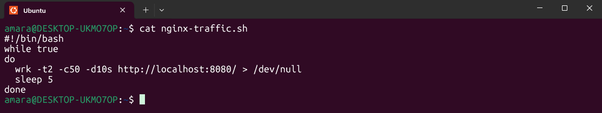
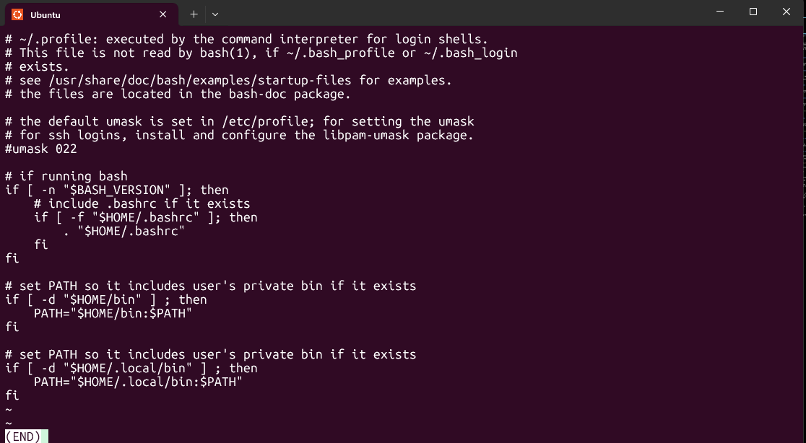
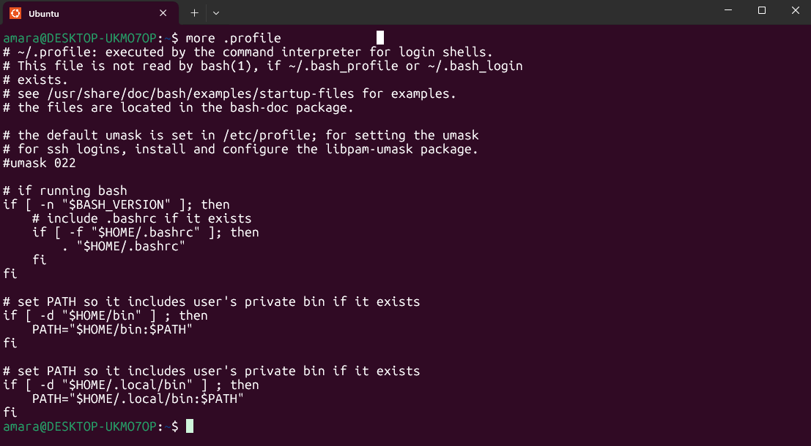
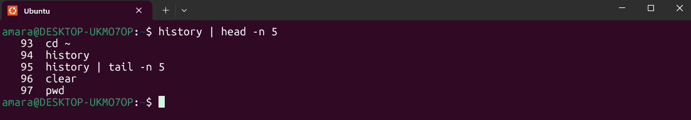
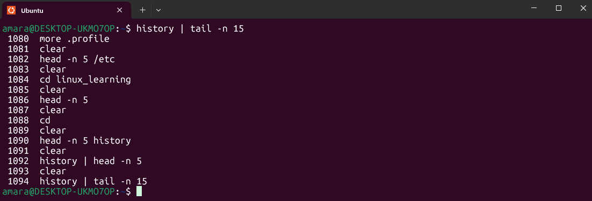

#  Day 4 of My Linux Learning Journey  
**Topic:** Viewing Files in Linux – `cat`, `less`, `more`, `head`, `tail`  

---

##  Learning Objective  
Today’s goal was to understand how to **view and analyze file content** in Linux using essential commands. These commands are extremely useful for:  
- Reviewing configuration files  
- Reading documentation directly from the terminal  
- Debugging errors and monitoring logs in real-time  

---

##  Commands Learned

### 1. `cat` – Concatenate and Display File Content
```bash
cat filename.txt
```
- Prints the entire file to the terminal.  
- Best for **small files**, because large files can flood the screen.
-   

---

### 2. `less` – View File One Screen at a Time
```bash
less filename.txt
```
- Allows scrolling with `↑` `↓`, `PgUp`, `PgDn`.  
- Press `q` to quit.  
- **Efficient for large files** since it doesn’t load everything at once. 
-  

---

### 3. `more` – Older Pager Utility
```bash
more filename.txt
```
- Similar to `less` but more limited.  
- Use `space` to scroll forward, `q` to quit. 
-  

---

### 4. `head` – View the First Lines of a File
```bash
head filename.txt
```
- Shows the first 10 lines by default.  
- Useful to preview file headers or metadata.  

Custom example:
```bash
head -n 5 filename.txt   # Show first 5 lines
```
- 

---

### 5. `tail` – View the Last Lines of a File
```bash
tail filename.txt
```
- Shows the last 10 lines by default.  
- Helpful for checking recent log entries.  

Custom example:
```bash
tail -n 15 filename.txt   # Show last 15 lines
```
- 

---

### 6. `tail -f` – Follow Files in Real-Time
```bash
tail -f /var/log/syslog
```
- Continuously streams new lines as they are added.  
- Essential for **real-time log monitoring** (e.g., debugging services, monitoring errors).  

---

##  Real-World Use Case 

 **Scenario:**  
You deploy a web server (e.g., Nginx). A user reports that a webpage is not working.  

Instead of guessing, you **watch the logs in real time**:  

```bash
sudo tail -f /var/log/nginx/access.log
```

Then you try accessing a non-existent page:  

```bash
curl http://localhost/missingpage
```

###  Result:
In the log, you’ll see an entry like:  
```
127.0.0.1 - - [29/Jun/2025:15:42:03 +0100] "GET /missingpage HTTP/1.1" 404 153 "-" "curl/7.81.0"
```

From this, you immediately know the page is missing (`404 Not Found`).  
This helps you **quickly identify issues**, instead of wasting time on guesswork.  

---

##  Key Takeaways
- Use **`less`** instead of `cat` for large files.  
- **`head`** and **`tail`** make it easy to preview sections of files.  
- **`tail -f`** is invaluable for **real-time monitoring of logs**.  
- Logs may be stored in **different files** (`/var/log/nginx/access.log` for 404s, `/var/log/nginx/error.log` for permission issues).  


👩🏽‍💻 *Documented by:* **Amarachi Ezeonyekwere**  
