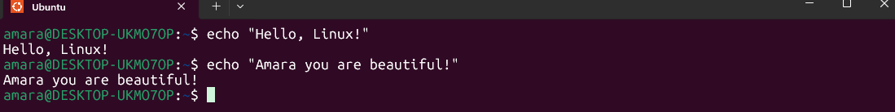

#   Day 5 of My Linux Learning Journey  
**Topic:** Creating and Editing Files – `touch`, `nano`, `vi`, `echo`, and More!  

---

##  Learning Objectives
By the end of this lesson, I should be able to:  
- Create files in Linux using different methods  
- Edit files using `nano` and `vi`  
- Write or append text into files with `echo` and `redirection`  
- Understand when to use each method in real-world scenarios  

---

##  Key Commands Covered

###  `touch` – Create Empty Files
* Creates a new, empty file.
* If the file already exists, it updates the *last modified* timestamp.

 Example:

```bash
touch report.txt
```


---

###  `echo` – Print Text or Write to File

```bash
echo "Hello, Linux!"
```
 Output:

```
Hello, Linux!
```

---

###  `nano` – Beginner-Friendly Editor

```bash
nano report.txt
```

* Opens a text file in the **nano editor**.
* Commands are displayed at the bottom of the screen.

Common nano shortcuts:

* `CTRL + O` → Save changes, then click enter
* `CTRL + X` → Exit editor


---

###   `vi` (or `vim`) – Advanced Text Editor

```bash
vi report.txt
```

* Opens file in **Normal mode** by default.
* To start typing → press `i` (Insert mode).
* To stop typing → press `Esc`.
* Save & quit → type `:wq` and press `Enter`.
* Quit without saving → type `:q!` and press `Enter`.

 Navigation in Normal mode:

* `h` → left, `l` → right
* `j` → down, `k` → up
* `0` → beginning of line, `$` → end of line
* `gg` → top of file, `G` → bottom of file


---

###  Redirection Operators

* `>` → Write (overwrite)
* `>>` → Append
* `| tee file.txt` → Write to file **and** show on screen

📌 Example with `tee`:

```bash
echo "System health check passed" | tee health.log
```


---

## 🔍 Real-World Use Case

**Scenario:**
As a junior DevOps engineer, I need to capture the **latest error logs from nginx** for daily monitoring. Instead of manually copying logs, I can automate it with Linux commands.

**Step-by-step:**

```bash
# 1. Create a summary file
touch log_summary.txt

# 2. Add a timestamp
echo "Nginx error summary for 2025-09-01" >> log_summary.txt

# 3. Append the last 10 error log entries
sudo tail -n 10 /var/log/nginx/error.log | tee -a log_summary.txt
```

✅ Now I have a daily running file that records error summaries for troubleshooting.


---

## 💡 What I Learned

* Multiple ways to create and edit files in Linux
* `nano` is beginner-friendly, while `vi` is powerful for advanced editing
* `echo` is not just for printing — it’s useful for writing to logs and scripts
* Redirection (`>`, `>>`, `| tee`) makes file operations more flexible
* Real-world case: logging error summaries for nginx helps with system monitoring

---


👩🏽‍💻 *Documented by:* **Amara Ezeonyekwere**  


